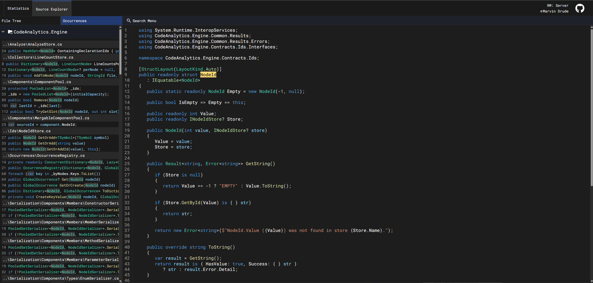
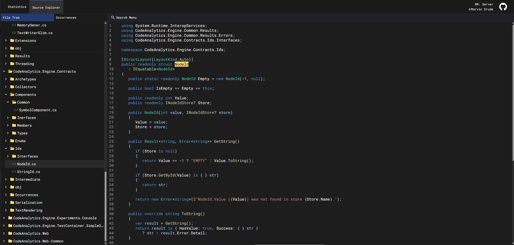

# C# Solution/Project Analytics

**Turn your C# solutions into actionable and interesting insights.**  
CodeAnalytics.Engine parses .sln/.csproj structures, source files, references, and metrics, then exposes them for rich exploration in a Blazor-based Web Viewer. A lightweight console collector transforms your codebase into analyzable data, while the built‑in Source Browser lets you jump through files, symbols, and dependencies with ease.

> ⚠️ Early stage: APIs, storage formats, and UI pieces are still evolving - expect breaking changes.

## Supported features so far

- Fast Collector Console tool ⚡
   - Scan solutions/projects and emit normalized metadata + metrics 🧭
- Web Viewer of collected data 🖥️
   - Dashboard (coming) 📊
   - Source Explorer 📂
      - View Souce Code in nice highlighting 🎨
      - Navigate files and folders 📁
      - Find all occurrences of Symbols like classes, methods etc by clicking on them 🔍
## Coming up
- Search in Source Explorer 🔎 
- Metrics dashboard in the web viewer 📈
- Always more metrics ➕
- Advanced rules like ex: Warning for specific methods used in loops (DB Calls etc.) 🚨

## Example Screenshots so far

## Contributing

First off - thank you for even considering it ❤️

### Reality check
I don’t have much bandwidth to review and merge public contributions. That means most unsolicited PRs will likely sit for a while or be closed.

### If you *really* want to help
- **Ask first:** Open a short issue or discussion describing what you’d like to do. If I give a 👍 there, we’ll both save time.
- **Keep it small:** Focused, self‑contained changes are far easier for me to review.

### Rights & licensing
By submitting a pull request, you agree that:
- Your contribution is licensed under the same license as this project; and
- I may use, modify, redistribute, and relicense your contribution as part of the project, now and in the future.

If that’s not OK with you, please don’t submit the PR.

### Thanks anyway
Even if I can’t merge your work, I genuinely appreciate the interest and ideas. Issues, suggestions, and bug reports are still welcome!

— Cheers!